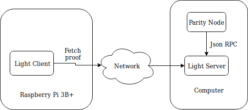

# Ethereum FlyClient Implementation

This repository hosts the code for the Master thesis 'Evaluation and Improvement
of Ethereum Light Clients'. The goal is to implement the
[FlyClient](https://eprint.iacr.org/2019/226) protocol introduced by Bünz et al.
with the Rust programming language. Note that it is not possible to deploy this
project in production, because the Ethereum Blockchain has to be modified in
order to allow the usage of the FlyClient approach.

This is the architecture, which illustrates the setup of the thesis:

The following projects are contained:

* **flyclient_ethereum** is a library, which contains an implementation of a
  Merkle Mountain Range tree (MMR) and FlyClient proofs can be generated and
  validated.

* **light_client** is a program, which can fetch FlyClient proofs from the
  server and validates them. This program is able to run on a Raspberry Pi 3B+,
  therefore a cross-compilation of the Rust program is possible.

* **light_server** is a program, which fetches block headers from a running
  Parity or Geth node and builds the corresponding Merkle Mountain Range tree.
  This tree is required in order to generate FlyClient proofs. Every 128 blocks
  a proof is generated, which a client can fetch. For measurement purposes all
  fetched block headers are stored in a 'csv' file in order to quickly build the
  MMR again after a server shutdown.

* **measurements** contains scripts in order to conduct measurements and
  visualizations about the resource consumption of the **light_client**
  implementation.

* **parity-ethereum** is a fork of Parity-Ethereum in version 2.5.10. The only
  difference to the official version is the deletion of two small methods in
  order to allow a successful compilation. This project is required in order to
  build the **light_client**, because it makes use of the Ethash algorithm in
  order to validate the proof-of-work of the Ethereum blocks.

The compilation of the Rust programs are tested with Rust version 1.39. The
command `$ cargo build` can be used in order to build the project in the
coresponding directory.
